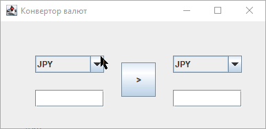

<h1 align="center">Лабораторна робота №2</h1>
<h2 align="center">Тема: Використання граічного UI в мові Java. Бібліотека Swing</h2>
<h2 align="center">Виконав студент групи 6.1221</h2>
<h2 align="right">Федотов Євгеній Євгенійович</h2>
<h2 align="right">Варіант 1 (V = (13 mod 13) + 1)</h2>
<h3 align="center">Завдання </h3>

Калькулятор пересчета курса валют (Замечание. Данные о кросс-курсах берутся из файла конфигурации).

<h3>Результат виконання роботи:</h3>

